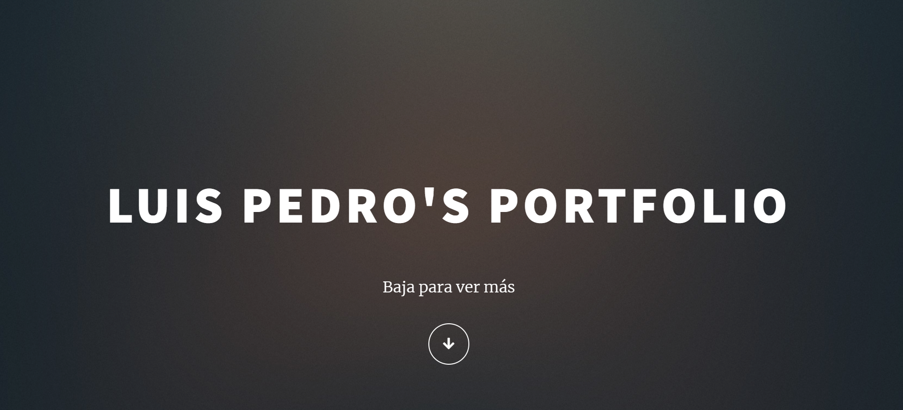

# Proyecto 3 | Portafolio Personal

El objetivo de este proyecto era hacer un portafolio personal de lo aprendido en clase.

### Autor:
- Luis García [@luispedro10](https://github.com/luispedro10)

# Pagina Publicada en Firebase
#### Portafolio
[Pagina :link:](https://portafolio-d9260.firebaseapp.com/index2.html)

**Tambien se puede ver la pagina de esta manera**

1. Clonar este repositorio 
2. Abrir index.html en un Live Server/localhost

# Herramientas usadas :wrench:
* SASS
* JavaScript
* HTML
* CSS

